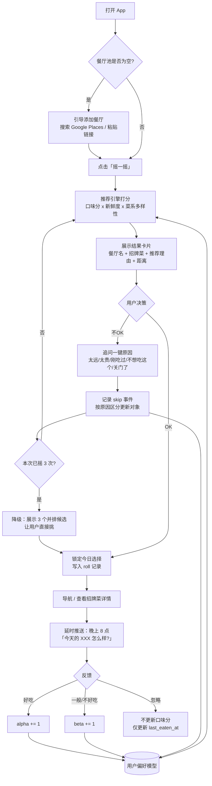

# 「今天吃什么」产品企划书
 
个人化餐厅决策助手 · v1.0
 
---
 
## 0. 一句话定位
 
> 你只需要维护一个「想吃的餐厅池」，剩下的交给它：每天摇一个，你说 OK 或不 OK，吃完给个反馈，它越用越懂你，并且不会让你连吃三天火锅。
 
**产品本质不是「餐厅搜索」，而是「决策疲劳消除器」。**
这个定位决定了一切设计：主界面只有一个按钮，不是一个列表。搜索型产品让你选，这个产品替你选。
 
### 三条设计原则
 
1. **两秒出结果** —— 打开 App 到看到「今天吃 XXX」不超过 2 秒，中间不能有任何加载态、筛选器、登录墙。
2. **每一次交互都是训练数据** —— OK / 不OK / 好吃 / 不好吃，四个动作全部落库。没有埋点的交互等于白做。
3. **可解释** —— 永远告诉用户"为什么是它"（「你 3 周没吃了 · 上次给了好评 · 招牌菜：黑松露牛肉面」）。黑盒推荐在单用户场景里会让人失去信任。
---
 
## 1. 我做的假设（如果不对请推翻，方案要改）
 
| # | 假设 | 影响 |
|---|---|---|
| A1 | 单用户 / 小圈子自用，不是面向公众的社区产品 | 决定了不能用协同过滤，必须用 Bandit |
| A2 | 餐厅池规模 20–100 家，不是全城几万家 | 算法可以全量打分，不需要召回层 |
| A3 | 手机使用为主（中午 11:30 站在办公室楼下） | PWA 优先，桌面端是附属 |
| A4 | 你自己写代码（或用 AI 辅助写），不是外包 | 排期按业余时间估 |
| A5 | 愿意每月花 0–25 美金 | 决定了托管和 API 选型 |
 
---
 
## 2. 核心流程图
 

 
### 关键流程说明
 
**「不OK」的原因收集是整个产品最高杠杆的一个设计。**
 
不带原因的 skip 是一个含义模糊的负信号——你不知道用户是讨厌这家店，还是只是今天不想走那么远。带原因之后，同一个动作可以精确地更新不同的模型：
 
| 原因 | 更新对象 | 不更新什么 |
|---|---|---|
| 太远了 | 距离权重（上下文特征） | 口味分 |
| 太贵了 | 价格敏感度（可能按星期几变化） | 口味分 |
| 刚吃过 | 冷却期 τ 调长 | 口味分 |
| 不想吃这个菜系 | 菜系级冷却 | 该餐厅口味分 |
| 关门了 / 排队太长 | 营业状态 / 时段可用性 | 口味分 |
| 就是不想吃 | 口味分 β += 1 | —— |
 
一次多余的点击，换来的是把一个噪声信号变成六个干净的特征。这是小数据量场景下最划算的交易。
 
---
 
## 3. 功能模块拆解
 
### P0 —— MVP（没有这些就跑不起来）
 
- **餐厅池管理**：增删改查。添加方式：Google Places 搜索自动补全（拿到 place_id、坐标、价格档、菜系标签）；手动输入兜底。
- **摇一摇**：加权随机 + 冷却期。结果卡片。
- **OK / 不OK**：不OK 触发重摇 + 一键原因 chips。
- **吃后反馈**：好吃 / 一般 / 不好吃（三档比二值信息量大，且用户心理负担不重）。
- **历史记录**：能翻看「我这个月吃了什么」。这是留存的隐藏功能——人会喜欢看自己的饮食日记。
### P1 —— 让它变好用
 
- **招牌菜展示**：每家店 3–5 道，带「被提及次数」和一句原话摘要。
- **PWA 安装**：加到主屏，全屏无浏览器地址栏，看起来像原生 App。
- **菜系多样性约束**：连续吃辣自动降权。
- **推荐理由文案**：一行字解释为什么是它。
- **每日定时推送**：11:30 推「今天吃什么？」，20:00 推「今天那家怎么样？」。Web Push 在 iOS 16.4+ 的 PWA 里可用。
### P2 —— 让它变聪明
 
- **Thompson Sampling 口味模型**（见第 4 节）
- **上下文感知**：天气、星期几、时段、上一餐吃了什么
- **数据看板**：菜系分布饼图、口味雷达、复购率、「你的年度餐厅 Top 10」
- **多人模式**：和同事/伴侣一起摇，取交集（这是唯一能让产品破圈的功能，但先别做）
### P3 —— 锦上添花
 
- 菜品级推荐（不只推店，直接推「去这家点这道」）
- 预算追踪
- 导出/导入餐厅池
---
 
## 4. 推荐算法演进路线 ★
 
这是产品的核心资产。关键认知：**这不是一个协同过滤问题，是一个多臂老虎机（Multi-Armed Bandit）问题。**
 
单用户 + 几十家店 + 稀疏反馈的场景下，协同过滤和深度模型完全用不上（没有别的用户数据可以借）。而 Bandit 恰好天生适配：每家餐厅是一个「臂」，每次摇一摇是一次「拉臂」，好评是「奖励」，并且它自带探索/利用的平衡——这正好对应「既要吃我爱吃的，又不能老吃同一家」。
 
### V0：加权随机 + 时间冷却（第 1 周）
 
不要一上来就写 Thompson Sampling。V0 的目标是把数据管道跑通。
 
```python
# 新鲜度：刚吃过接近 0，越久越接近 1
freshness = 1 - exp(-days_since_last_eaten / TAU)   # TAU ≈ 14 天
 
# 菜系惩罚：3 天内吃过同菜系
cuisine_penalty = 0.4 if cuisine_eaten_within(3) else 1.0
 
score = base_weight * freshness * cuisine_penalty
P(i)  = score_i / sum(score)      # 按概率抽样，不是取最大值
```
 
`base_weight` 默认 1.0，用户可以手动标「特别想吃」拉到 2.0。
**必须按概率抽样而不是取 argmax**，否则每天结果一样，产品就死了。
 
### V1：Thompson Sampling（第 5–6 周）
 
给每家店维护一个 Beta 分布，代表「我对这家店的喜爱程度」的不确定性估计。
 
```python
# 每家餐厅维护 (alpha, beta)
# 新店冷启动：Beta(2, 1) —— 乐观先验，保证新店有机会被试到
 
theta_i = random.betavariate(alpha_i, beta_i)      # 从后验采样
final_i = theta_i * freshness_i * cuisine_penalty_i
pick    = argmax(final_i)                          # 采样已经引入随机性
 
# 反馈更新
好吃          → alpha += 1.0
一般          → alpha += 0.3, beta += 0.3
不好吃        → beta  += 1.0
skip(纯不想吃) → beta  += 0.3     # 弱负信号
skip(太远/关门) → 不更新口味，只更新上下文特征
忽略反馈       → 不更新
```
 
**为什么 Thompson Sampling 特别适合这里：**
 
- 冷启动优雅：只吃过 1 次的店后验方差大，采样波动大，自然会被多试几次；吃过 10 次的店后验收敛，表现稳定。这就是「探索」和「利用」的自动平衡，不需要手调 ε。
- 只需要两个数字就能表达一家店的全部状态，存储和调试都极简。
- 天然可解释：`alpha/(alpha+beta)` 就是「你有多喜欢这家店」，可以直接画成星级展示给用户。
**衰减机制**：口味会变。每月对所有 (α, β) 乘以 0.95，让久远的历史逐渐失效。这一行代码能防止「三年前吃过一次觉得难吃，从此再也推不到」。
 
### V2：上下文 Bandit（第 8–10 周）
 
当 roll 记录累积到 200+ 条，可以引入上下文。
 
特征：`[星期几, 时段, 天气(温度/是否下雨), 距离, 价格档, 菜系 one-hot, 距上次吃同菜系天数, 上一餐是否重口]`
 
模型：**在线逻辑回归**预测 `P(accept)`，或 LinUCB。不要上 XGBoost/神经网络——几百条样本喂不饱，而且失去可解释性。
 
关键工程处理：数据量不足时用**层级先验回落**——上下文模型的预测和 V1 的 Beta 后验做加权融合，权重随样本量增长：
 
```python
w = n_samples / (n_samples + 50)
final = w * contextual_score + (1 - w) * thompson_score
```
 
这样 V2 上线不会让效果比 V1 更差，可以安全灰度。
 
### V3：菜品级 + LLM 重排（长期）
 
- 把每家店的招牌菜文本做 embedding，聚合出用户的口味向量（辣度、汤水、碳水、清淡度、蛋白类型）
- **MMR 多样性重排**：在 Top-5 候选里，选一个既高分又和最近三天吃的距离远的
- LLM 生成推荐理由：把「最近三餐 + 今天天气 + 候选店招牌菜」丢给 Claude Haiku，让它写一句人话——「连着两天重口，今天降温了，去喝碗那家你上次夸过汤头的粉？」
> ⚠️ **最重要的一条工程建议：从 V0 第一天起，就把每次 roll 的完整上下文快照写进数据库**（时间、天气、位置、当时的候选池、当时的打分、用户动作）。V2 需要的训练数据无法事后补齐。这是唯一一个「现在不做，以后要重来」的决策点。
 
---
 
## 5. 数据源方案（招牌菜从哪来）
 
目标：给每家餐厅拿到 3–5 道「大家都在夸」的菜。
 
### 统一处理管线
 
```
原始文本（评论/帖子/笔记）
   ↓
Claude Haiku 抽取（结构化 JSON）
   ↓ {dish_name, mention_count, sentiment, quote}
去重归一化（"黑椒牛柳" == "黑胡椒牛柳"）
   ↓
按提及次数排序，存入 dishes 表，缓存 30 天
```
 
Prompt 大意：*「从以下评论中提取被具体提到的菜品名称。只返回 JSON 数组，字段：菜名、提及次数、情感倾向、一句原文摘录。忽略泛泛的评价。」*
 
### 各数据源可行性对比
 
| 数据源 | 官方 API | 可行性 | 说明 |
|---|---|---|---|
| **Google Places API (New)** | ✅ 有 | 🟢 首选 | 合法稳定。`Place Details` 返回 place_id、坐标、价格档、类型标签。**限制：只返回约 5 条评论**，做菜品抽取样本偏薄，但足够 MVP。按 SKU 计费，缓存后成本极低 |
| **Reddit** | ✅ 有官方 API | 🟡 可做 | 免费额度对个人自用足够。搜 `r/[城市]` + `r/food` 相关帖。**问题：中文餐厅覆盖差，北美城市效果好，亚洲城市基本空** |
| **小红书** | ❌ 无开放 API | 🔴 有风险 | 见下方专门说明 |
| **大众点评 / 美团** | ❌ 无开放 API | 🔴 有风险 | 同样反爬严格 |
| **用户自己的笔记** | —— | 🟢 被低估 | 你自己吃完记一句「这家的 XX 好吃」，是**质量最高**的数据源 |
 
### 关于小红书，需要坦白说明
 
小红书没有对外开放的内容 API。技术上抓取会遇到签名参数（x-s / x-t）、滑块验证、IP 风控，维护成本高且不稳定；同时**爬取行为违反其用户协议，存在账号封禁和法律风险**，我不建议把它做成产品的自动化依赖。
 
**推荐的替代设计（既合规又好用）：手动导入 + AI 抽取**
 
在餐厅详情页放一个大输入框：「把小红书笔记内容粘贴进来」。用户看到一篇好笔记时复制正文粘贴进去，Claude 自动抽出菜名、避雷点、人均，结构化存好。
 
这个方案看起来是「退而求其次」，但实际上有三个优势：一是完全合规、零维护；二是用户主动粘贴的笔记，相关性远高于自动抓取的噪声；三是这个动作本身就是很强的正向信号——**愿意花力气粘贴笔记的店，说明你是真想去**，可以直接给 `base_weight` 加成。
 
后续如果 OCR 更方便，可以做成「分享截图到 App → OCR → 抽取」，交互成本进一步降低。
 
### MVP 建议的数据源组合
 
**Google Places（基础信息 + 少量评论）+ 手动粘贴（深度内容）**，Reddit 放到 P2 视你所在城市决定是否值得做。
 
---
 
## 6. 数据模型
 
```sql
-- 餐厅主体（可跨用户共享，避免重复抓取）
restaurants (
  id, google_place_id, name, lat, lng, address,
  price_level, cuisine_tags[], phone, opening_hours jsonb,
  updated_at
)
 
-- 用户与餐厅的关系 ★ 推荐模型的状态全在这里
user_restaurants (
  user_id, restaurant_id,
  base_weight    default 1.0,
  alpha          default 2.0,     -- Thompson 乐观先验
  beta           default 1.0,
  last_eaten_at, eat_count, skip_count,
  status         enum(active|paused|archived),
  user_note,
  PRIMARY KEY (user_id, restaurant_id)
)
 
-- 招牌菜
dishes (
  id, restaurant_id, name_normalized, name_raw,
  mention_count, sentiment, quote, source_id, extracted_at
)
 
sources (
  id, restaurant_id,
  type enum(google_review|reddit|manual_note|user_own),
  raw_text, url, fetched_at
)
 
-- ★ 训练数据的核心表，第一天就要建全
rolls (
  id, user_id, restaurant_id, rolled_at,
  candidates_snapshot jsonb,   -- 当时全部候选及其分数
  algo_version text,           -- 'v0' / 'v1' / 'v2'，用于回溯对比
  context jsonb,               -- {weekday, hour, weather, temp, location}
  action enum(accepted|skipped),
  skip_reason enum(too_far|too_pricey|just_ate|wrong_cuisine|closed|no_mood|other),
  roll_index int               -- 今天第几次摇
)
 
feedbacks (
  id, roll_id, rating enum(good|ok|bad),
  dish_ordered text, note, created_at
)
```
 
`candidates_snapshot` 和 `algo_version` 这两个字段是给未来的你准备的——换算法之后想知道「新版本是不是真的更好」，全靠它们做离线回放对比。
 
---
 
## 7. 技术栈
 
### 推荐方案（低运维、单人可持续维护）
 
| 层 | 选型 | 理由 |
|---|---|---|
| 框架 | **Next.js 15 (App Router) + TypeScript** | 前后端一体，Server Actions 省掉一整层 API 样板代码 |
| UI | **Tailwind CSS + shadcn/ui** | 复制粘贴组件，不引入 UI 库依赖 |
| 动画 | **Framer Motion** | 「摇骰子」的翻牌动效是产品的情绪价值所在，值得花时间 |
| 数据库 | **Supabase (Postgres)** | 自带 Auth、Row Level Security、REST。免费额度对自用完全够 |
| ORM | **Drizzle** | 轻量、类型安全、SQL 贴近原生（推荐算法要写不少手写查询） |
| 托管 | **Vercel** | 与 Next.js 零配置集成，自带 Cron |
| 定时任务 | **Vercel Cron** | 每日推送、月度评论刷新、口味衰减 |
| 推送 | **Web Push API** | PWA 场景下 iOS 16.4+ / Android 均支持 |
| AI | **Claude API (Haiku)** | 菜品抽取、推荐理由生成。成本可忽略 |
| 地图/数据 | **Google Places API (New)** | 餐厅信息与评论 |
 
### 关于「网站」这个形态
 
你说的是网站，我建议做成 **PWA（渐进式网页应用）**：本质还是网页，但可以「添加到主屏幕」，全屏运行、支持推送、有离线缓存，体验接近原生 App，同时省掉 App Store 审核和双端开发。
 
对这个产品来说这一点很关键——决策发生在「站在写字楼下、饿了、不想想」的那一刻。如果需要打开浏览器、输网址、等加载，这个产品在真实场景里根本用不起来。桌面浏览器只应该用来做「批量管理餐厅池」这类低频操作。
 
### 替代方案
 
- **想要更简单**：Supabase + 纯前端（Vite + React），无服务端。缺点是 API key 保护和定时任务不好做。
- **偏好 Python**：FastAPI + Postgres + React 前端。算法迭代时 numpy/scipy 生态更顺手，代价是要维护两个仓库、两套部署。
- **极简起步**：先做个不联网的单页 HTML，把餐厅池存 localStorage，把 V0 算法跑通验证产品感觉。**半天就能做完，强烈建议先做这个。**
---
 
## 8. 开发排期
 
按 **业余时间投入，每周约 10–15 小时** 估算。全职投入约为 1/3 时长。
 
| 阶段 | 内容 | 工期 | 交付标准 |
|---|---|---|---|
| **P-1 原型验证** | 单页 HTML，localStorage，V0 算法 | **0.5 天** | 自己用一周，确认「摇一摇」这个交互真的解决了你的问题 |
| **P0 MVP** | 项目搭建 + Auth + 餐厅 CRUD + Google Places 搜索 + V0 算法 + OK/不OK + 反馈 + rolls 落库 | **2 周** | 能替代原型，数据进数据库 |
| **P1 好用** | 招牌菜抽取管线 + 结果卡片打磨 + 摇骰动效 + PWA + 推送 + 历史记录 | **2 周** | 每天真的会打开用 |
| **P2 变聪明** | Thompson Sampling + 菜系多样性 + skip 原因体系 + 数据看板 | **1.5 周** | 推荐明显比随机准 |
| **P3 扩展** | Reddit 接入 + 小红书手动导入 + 上下文 Bandit + LLM 推荐理由 | **3 周** | —— |
 
**MVP 可用（P0+P1）：约 4 周**
**完整版（到 P2）：约 6 周**
**含全部数据源和高级算法：约 9 周**
 
如果全程用 AI 辅助编码（Claude Code 之类），P0+P1 压缩到 1.5–2 周是现实的——这类 CRUD + 表单 + 卡片 UI 的工作量正是 AI 最擅长压缩的部分。而算法调优和数据源接入的时间省不掉，因为瓶颈在判断而不是打字。
 
### 排期里的取舍说明
 
我把「招牌菜」放在 P1 而不是 P0，是因为 MVP 阶段最需要验证的是**摇一摇这个核心交互你会不会真的每天用**。如果这个不成立，招牌菜做得再好也没意义。反过来，如果 P-1 原型你用了一周就腻了，那说明产品假设有问题，此时只损失了半天。
 
---
 
## 9. 成本估算
 
| 项目 | 月成本 |
|---|---|
| Vercel Hobby | $0（自用足够） |
| Supabase Free | $0（500MB，几十万条记录没问题） |
| Google Places API | ~$0–5（有月度免费额度，且结果缓存 30 天，30 家店几乎不消耗） |
| Claude API (Haiku) | ~$1（菜品抽取一次性 + 偶尔刷新） |
| 域名 | ~$1（$12/年） |
| **合计** | **约 $2–7 / 月** |
 
规模化到几百用户后，Vercel Pro + Supabase Pro 约 $45/月，Places API 成本随餐厅数线性增长（缓存后增速很慢）。
 
---
 
## 10. 成功指标
 
**北极星指标：连续使用天数 / 周活跃天数。** 这是一个高频刚需产品，如果一周用不到 3 次，说明没有真正嵌入生活。
 
辅助指标：
 
| 指标 | 定义 | 目标 |
|---|---|---|
| **首摇采纳率** | 第一次摇就点 OK 的比例 | V0 基线约 40%，V2 目标 > 65% |
| **平均摇动次数** | 每次决策摇了几下 | < 1.6 |
| **好评率** | 反馈为「好吃」的占比 | 持续上升 |
| **反馈回收率** | 有多少次进食收到了反馈 | > 60%（低于此则模型缺粮，要优化推送） |
| **菜系多样性** | 30 天内菜系分布的熵 | 保持稳定，不能随时间下降 |
| **决策时长** | 打开到点 OK 的秒数 | < 15 秒 |
 
**多样性指标要专门盯着看**：推荐算法的通病是随着数据积累不断收敛到少数几个高分选项，形成回音室。对这个产品来说，「老吃同样的」正是用户最初想解决的痛点——如果熵在下降，算法就是在背叛产品的初衷。这时候要调大冷却期 τ 或提高探索强度。
 
---
 
## 11. 主要风险与坑
 
| 风险 | 影响 | 应对 |
|---|---|---|
| **小红书无法合规接入** | 内容丰富度受限 | 手动粘贴 + AI 抽取，已在第 5 节展开 |
| **Google 评论只有 5 条** | 菜品抽取样本薄 | 用用户自己的笔记补充；同一家店多次抓取可拿到不同评论，累积存档 |
| **反馈回收率低** | 模型学不到东西 | 推送做得轻（一键三选）；忽略也算弱信号；绝不用弹窗强制 |
| **冷启动无数据** | 前两周推荐等于随机 | 用乐观先验保证覆盖；诚实告知用户「前两周我在熟悉你」，预期管理比假装聪明好 |
| **餐厅池太小** | 摇来摇去就那几家 | 检测到池 < 10 家时主动提示添加；可基于现有池的菜系做同城拓展推荐 |
| **过拟合到少数几家** | 多样性坍缩 | 见上，监控熵 + 强制探索配额（比如每周至少 1 次纯探索） |
| **自己用腻了** | 项目烂尾 | 这是最大的风险。所以强烈建议先花半天做 P-1 原型验证 |
 
---
 
## 12. 我的建议：从哪一步开始
 
不要从技术栈开始。**这个周末花半天，做一个不联网的单页 HTML**：一个数组存 15 家你常去的餐厅，一个按钮，V0 那三行公式，OK/不OK 两个按钮把结果 `console.log` 出来。
 
然后真实地用一周。
 
一周后你会得到三个正式开发之前必须知道的答案：
 
1. 摇一摇这个交互，在你真的饿着的时候，是让你松一口气，还是让你觉得多此一举？
2. 冷却期 τ 到底该是多少天？（我猜的 14 天很可能不对，只有用了才知道）
3. 「不OK」的时候，你脑子里真实的原因是什么？把它们记下来——那就是第 3 节那张原因表的正确版本，比我拍脑袋列的准。
带着这三个答案再开 Next.js 项目，你会少走两周弯路。
 
---
 
## 附录：MVP 界面结构
 
```
┌─────────────────────────┐
│  今天吃什么              │  ← 极简顶栏，无导航
│                         │
│    ┌───────────────┐    │
│    │               │    │
│    │   🎲 摇一摇    │    │  ← 唯一主按钮，占屏幕 40%
│    │               │    │
│    └───────────────┘    │
│                         │
│  ─── 结果卡片 ───        │
│  川味观园                │
│  ⭐ 4.3 · $$ · 800m     │
│  🔥 招牌：水煮鱼、口水鸡  │
│  💡 你 3 周没吃了，       │
│     上次给了好评          │
│                         │
│  [ 就它了 ]  [ 换一个 ]  │
│                         │
├─────────────────────────┤
│  🎲摇  📋池  📊记录       │  ← 底部三 Tab，仅此三个
└─────────────────────────┘
```
 
界面上任何一个不服务于「两秒内做出决定」的元素，都应该被删掉或藏进二级页面。